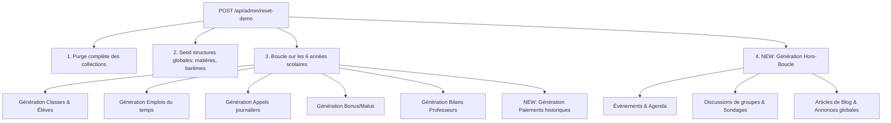

# Spécification Technique : Seeding Profond de Données Historiques de Démo
## Projet : YANIS School Management

### 1. Objectif
L'objectif de cette spécification est de définir l'architecture et les règles de génération de données factices approfondies pour l'école de démo (sur 6 années scolaires). Cela donnera une illusion parfaite d'une école active, vivante et historiquement documentée.

---

### 2. Périmètre des Données à Générer

#### A. Évènements Scolaires (Agenda)
Générer un calendrier d'évènements scolaires riche pour chaque année scolaire (de 2020-2021 à 2025-2026), avec trois états temporels par rapport à la date actuelle :
*   **Évènements Passés** : Réunions parents-profs, fêtes de fin d'année, sorties scolaires, conseils de classe, compétitions sportives.
*   **Évènements En Cours** : Semaine culturelle, examens trimestriels.
*   **Évènements à Venir** : Prochaine rentrée, kermesse de fin d'année, examens nationaux.

#### B. Vie des Groupes & Forums de Discussion
Chaque classe ou groupe d'intérêt doit posséder un historique de discussion actif :
*   **Annonces de classe** (ex. : "Rappel : Apportez vos crayons de couleur demain").
*   **Sondages** interactifs (ex. : "Choix de la destination de la sortie de fin d'année : Zoo de Vincennes vs. Musée du Louvre").
*   **Discussions réalistes** entre enseignants, parents et élèves (messages de questions/réponses sur les devoirs, les absences, etc.).

#### C. Blog Scolaire & Communication Institutionnelle
Le blog de l'école ne doit plus être vide :
*   **Articles de blog** rédigés par l'administration ou les professeurs (ex. : "Retour sur la kermesse 2025", "Conseils pour les révisions d'été").
*   **Sondages globaux** à l'échelle de l'école (ex. : "Projet de nouvel uniforme : votez pour votre couleur préférée").
*   **Annonces importantes** (ex. : "Fermeture exceptionnelle pour travaux le 12 mai").

#### D. Suivi Financier & Historique des Paiements
Afin de rendre le panneau de contrôle financier réaliste pour chaque élève sur les 6 années d'historique :
*   **Frais d'écolage** : Générer des transactions de versement régulières (mensuelles ou trimestrielles) correspondant au profil de l'élève (ex. : Scolarité Base 350€, Cantine 120€, Transport 80€).
*   **Historique de facturation** : Suivi rigoureux avec soldes à jour pour chaque année scolaire archivée.

---

### 3. Architecture d'Implémentation dans le Seeder

Les générateurs seront implémentés sous forme de modules autonomes appelés depuis `app/api/admin/reset-demo/route.js`.

---

### 4. Modèles de Données & Structures de Seeding

#### A. Évènements (`Event`)
Pour chaque évènement généré, nous définirons :
*   `title` (String) : Titre de l'évènement.
*   `description` (String) : Description riche.
*   `date` (Number) : Timestamp de début.
*   `duration` (Number) : Durée en minutes.
*   `type` (String) : `'ACADEMIC' | 'SPORT' | 'CULTURE' | 'MEETING'`.
*   `target` (String) : `'GLOBAL' | 'CLASS' | 'GROUP'`.
*   `targetRef` (ObjectId) : Optionnel (référence à la classe ou au groupe).

#### B. Blog & Publications (`Post`)
*   `title` (String) : Titre de l'article.
*   `content` (String) : Corps de l'article.
*   `author` (String) : Nom de l'auteur (Directeur ou Professeur).
*   `type` (String) : `'BLOG' | 'ANNOUNCEMENT' | 'POLL'`.
*   `pollOptions` (Array) : Si type = `'POLL'`, tableau d'options `{ text: String, votes: Number }`.
*   `createdAt` (Number) : Date de publication.

#### C. Discussions de Groupes (`GroupMessage` & `Group`)
*   Créer 2 à 3 groupes d'intérêt généraux (ex. : *"Club Échecs"*, *"Association Sportive"*, *"Parents d'Élèves"*).
*   Seeder des messages réguliers sur les 12 derniers mois pour simuler une activité de messagerie instantanée fluide.

---

### 5. Plan de Validation
1.  **Réinitialisation de la démo** via l'interface d'administration.
2.  **Vérification de l'Agenda** : Navigation sur le calendrier pour confirmer la présence d'évènements passés, présents et futurs.
3.  **Vérification du Blog** : Lecture des articles, vote sur les sondages et consultation des annonces.
4.  **Vérification de la Messagerie** : Entrée dans les groupes pour valider l'historique des messages.
5.  **Vérification Financière** : Ouverture de la fiche de Lucas Lefèvre pour s'assurer que ses frais de scolarité, cantine et transport affichent des paiements réalistes sur les 6 ans.
