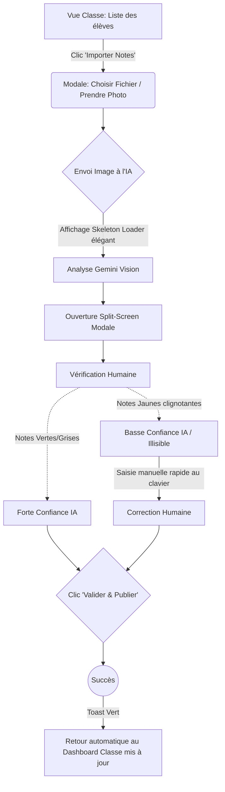
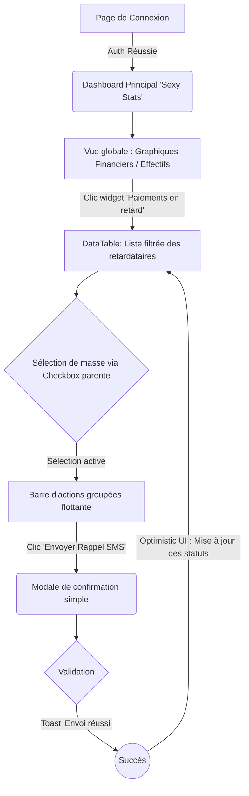

# UX Design Specification schoolManagment___PROJECT

**Author:** ERP_school
**Date:** 2026-02-21T20:51:43Z

---

<!-- UX design content will be appended sequentially through collaborative workflow steps -->

## Executive Summary

### Project Vision

L'évolution de Martin de Porrès s'articule autour de la création d'un ERP scolaire local offrant une fluidité "standard industriel". La vision UX repose sur un minimalisme "Zero-Waste", éliminant le surchargement technique et visuel pour offrir une interface réactive, rapide, focalisée sur la magie des automatisations intelligentes (Data extraction via IA) et l'accélération des tâches redondantes de gestion scolaire.

### Target Users

- **Moussa (Administrateur Principal)** : Utilisateur "Power User" nécessitant des vues consolidées très performantes et des outils d'actions groupées fluides pour des tâches annuelles complexes (rentrées, migrations financières).
- **Enseignants** : Utilisateurs concentrés sur le "Input/Output". Ils ont besoin d'outils magiques accélérant la saisie, avec des parcours d'interfaces orientés sur la validation (Review & Approve) plutôt que l'insertion manuelle complexe.
- **La Direction** : Utilisateurs passifs de statistiques, intéressés par un rendu cosmétique irréprochable et des données de pilotage lues en un coup d'œil.

### Key Design Challenges

- Concevoir une interface intuitive de vérification et d'édition pour la fonction "Photo-to-Web" qui gère élégamment les incertitudes de l'IA (matching OCR/Élève) sur des formulaires tabulaires.
- Gérer l'architecture de l'information (IA) pour regrouper un grand volume de données disparates (Entités CRUD complètes, agendas, paiements) dans un Dashboard fluide et sans sur-stimulation visuelle ("Render Storms").
- Standardiser un système de retour d'état instantané (Optimistic UI) pour masquer les temps de traitement lors de changements administratifs de masse.

### Design Opportunities

- Basculer de formulaires de saisies ennuyeux vers des interfaces dynamiques modernes axées sur la validation rapide ("Swipe to approve", "One-click validate").
- Créer une identité visuelle "Sexy Stats" très soignée et dynamique pour conforter la valeur premium de la plateforme auprès de la direction.
- Intégrer des micro-interactions de validation et de succès valorisantes pour atténuer l'austérité de la gestion de base de données d'un ERP classique.

## Core User Experience

### Defining Experience

L'action fondamentale ("Core User Action") de ce projet tourne autour de la **Validation des Saisies** plutôt que la saisie elle-même. Les administrateurs naviguent parmi d'importants sets de données ("Dashboard Review & Bulk Apply"), et les enseignants valident le travail automatisé de la machine ("Scan & Approve"). L'outil n'est plus un réceptacle de formulaires fastidieux, mais un assistant qui pré-mâche le travail.

### Platform Strategy

- **Application Web Responsive (Priority: Desktop/Tablet)** : Moussa gère l'école depuis un grand écran (optimisation de vue tabulaire et Dashboard complexe requise).
- Les enseignants prendront probablement leurs listes en photo via un mobile, nécessitant une vue "Photo-to-Web" très optimisée en `Touch-first` sur mobile (interface d'upload et de validation de notes pensée pour le pouce).
- Architecture "Rich Client" (React Contexts unifiés) pour fournir une navigation de type SPA (Single Page Application) garantissant l'absence de rechargements inopinés.

### Effortless Interactions

- **Optimistic UI sur le CRUD** : Les suppressions ou modifications groupées d'élèves sont instantanées sur le frontend, masquant complètement l'appel réseau ou la latence.
- **Formulaires Automatisés** : Remplissage des champs quasi-instantané après traitement IA, transformant le formulaire en une étape secondaire (et non plus primaire).
- **Navigation "Render-Storm-Free"** : Tout clic sur la navigation ou l'ouverture de modales (ex: `EntityModal`) s'affiche instantanément, une exigence critique du cahier des charges.

### Critical Success Moments

- **L'Aha Moment de la Rentrée** : Quand la migration et la configuration de centaines de profils élèves d'une année sur l'autre se valident en quelques clics via un écran de vérification groupé performant. 
- **La Magie du Scan** : Quand, au lieu de taper 35 notes, l'enseignant valide la reconnaissance optique réussie à l'aide d'une interface de comparaison "côte-à-côte" conviviale et sans erreur.
- **La Satisfaction de l'Admin** : Ouvrir le Dashboard rempli de statistiques Chart.js et naviguer vers la gestion d'une classe sans aucune surchauffe du navigateur ni chute de framerate.

### Experience Principles

- **Zero-Wait** : L'interface cache la latence des services externes (Mongodb, Gemini AI) grâce aux retours visuels, micro-chargements et mises à jour optimistes.
- **Guidance sur Saisie (Review over Write)** : Maximiser l'usage d'IA et de propositions auto-remplies, où l'humain devient l'approbateur (réduction de charge mentale).
- **Clarté Cognitive dans la Densité** : Maintenir un look premium ("Sexy Stats") en organisant l'information dense via des espaces négatifs, des accords de couleurs apaisants (bleu/orange brand de l'application) et une typographie claire.

## Desired Emotional Response

### Primary Emotional Goals

- **Apaisement & Maîtrise (Administrateurs)** : Remplacer l'anxiété liée aux temps de chargement par un sentiment de sérénité. Moussa doit sentir que la machine le suit sans jamais bloquer, lui donnant le contrôle absolu sur des données complexes.
- **Soulagement & Magie (Enseignants)** : Éprouver un sentiment de soulagement immédiat lié à l'élimination de la corvée de saisie. Voir l'IA extraire les notes en quelques secondes doit évoquer de la "magie" et le sentiment d'être assisté.
- **Fierté (Direction)** : Ressentir de la fierté face à un outil visuellement sophistiqué ("Sexy Stats") qui renvoie une image premium et statutaire de leur établissement.

### Emotional Journey Mapping

- **Découverte (Login/Dashboard)** : Clarté immédiate, sensation d'ordre. L'interface "souffle" (espaces négatifs), les chiffres sont nets, réduisant instantanément la charge cognitive (Calme).
- **Core Action (Rentrée/Saisie de classe)** : Pendant les actions massives, le système répond instantanément grâce à l'Optimistic UI. L'utilisateur se sent super-productif et en confiance (Empowerment).
- **En cas d'erreur (ex: IA incertaine)** : Frustration évitée grâce à un design "Review & Approve" indulgent et amical, qui souligne exactement ce qu'il faut vérifier de manière non punitive (Confiance).
- **Fin de tâche** : Une micro-animation de validation subtile mais claire ("Success State") offre une dose de dopamine, marquant la fin propre de l'effort (Satisfaction).

### Micro-Emotions

- **Confiance vs Confusions** : Les indicateurs d'état doivent toujours dire "Où suis-je" et "Que fait le système", particulièrement lors des appels API lents (via des skeletons harmonieux).
- **Légèreté vs Lourdeur** : Le logiciel de gestion scolaire ne doit pas donner l'impression de manipuler "un fichier Excel des années 90", il doit glisser comme une App grand public fluide.
- **Réassurance** : Lors des suppressions d'entités (ex: Élève sorti), l'interface doit rassurer sur la possibilité de réversibilité ou sur l'application correcte de l'action.

### Design Implications

- **Apaisement → Couleurs et Layouts** : Utilisation affirmée du bleu/orange institutionnel mais dans des tons pastel ou avec beaucoup d'espaces blancs. Éviter d'entasser les data-tables bout à bout.
- **Magie → Micro-interactions** : États de survol (hover) fluides, animations de skeleton harmonieuses lors des loadings, et transitions douces de l'IA remplissant un tableau.
- **Fierté → Typographie & Graphiques** : Typographie affirmée (ex: police sans-serif moderne, gros titres), intégration Chart.js léchée avec des ombres portées douces, et éléments distinctifs occasionnels (ex. bannière anniversaire).

### Emotional Design Principles

- **Le Calme dans la Complexité** : Cacher la tuyauterie ; le backend peut travailler fort (Gemini, Mongo) mais le FrontEnd reste placide et ne tremble pas (Render-Storm free).
- **Pardonner et Accompagner** : Le design assume que l'humain et l'IA peuvent se tromper ; l'UI est tolérante et l'édition manuelle post-IA est toujours évidente et sans friction.
- **Reward the User** : Convertir l'acte administratif pénible en micro-récompenses visuelles claires pour maintenir l'engagement.

## UX Pattern Analysis & Inspiration

### Inspiring Products Analysis

- **Notion (Desktop & Web)** : Excellent pour la "Clarté Cognitive dans la Densité". Notion gère des bases de données massives (tables, listes) avec un minimalisme absolu. Le look "clean", les espaces blancs abondants et l'absence de bordures lourdes rendent la lecture des tableaux agréable.
- **Expensify ou Alan (Mobile)** : Excellents en approche "Photo-to-Web" (Smart Scan). Leur prise en photo de reçus ou factures médicales extrait instantanément la data. L'UX est bluffante car le scan n'est pas vu comme une étape laborieuse mais comme un moment "magique" de validation quasi ludique.
- **Stripe Dashboard (Desktop)** : Le maître étalon des "Sexy Stats". Leurs graphiques d'analyse financière et leur disposition d'UI transmettent immédiatement confiance et sérieux, grâce à des typographies parfaites, des couleurs subtiles et une réactivité instantanée pour l'utilisateur Power-User.

### Transferable UX Patterns

**Navigation & Layout Patterns:**
- **Full-page Takeover pour les Actions Focus** : Pour l'extraction de notes par IA, utiliser un modale "Pleine Page" qui plonge l'enseignant au calme pour comparer la photo scannée et le tableau extrait, sans éléments de menu distrayants.
- **Skeleton Loaders Harmoniaux** : S'inspirer de Notion pour afficher des lignes de chargement grises et douces lors des appels MongoDB/Gemini, créant l'illusion d'instantanéité.

**Interaction Patterns:**
- **Toast Notifications Intelligents** : Ne pas bloquer l'écran avec une popup confirmant "L'élève a bien été migré". Utiliser un petit "Toast" en bas de l'écran avec une action "Annuler" temporaire (Undo pattern).
- **Split-Screen Review** : Pour valider les notes, avoir l'image scannée d'un côté et le tableau éditable de l'autre (patern souvent vu dans les outils de KYC ou de notes de frais).

### Anti-Patterns to Avoid

- **Les Formulaires "Page par Page" Interminables** : Forcer l'utilisateur à scroller à l'infini pour créer un élève. *Correction* : Utiliser des modales compactes avec des onglets ou une structure en accordéon.
- **Les Spinners Bloquants (Le sablier de la mort)** : Geler toute l'interface avec une roue tournante pendant l'enregistrement d'une donnée. *Correction* : Utiliser l'Optimistic UI.
- **Alertes et Erreurs Punitives** : Afficher de gigantesques messages rouges illisibles ("Erreur serveur interne"). *Correction* : Messages concrets et guidés ("La note de l'élève ligne 4 semble illisible, pouvez-vous la taper au clavier ?").

### Design Inspiration Strategy

**What to Adopt:**
- Le "Split-Screen Review" pour capitaliser sur l'outil "Photo-to-Web" (Vision Gemini). C'est la garantie d'une validation visuelle non douloureuse par l'enseignant.
- L'approche visuelle "Stripe/Notion" pour le Dashboard : Beaucoup d'espace négatif, polices modernes (type Inter), et composants aérés sans bordures agressives.

**What to Adapt:**
- L'Optimistic UI. Toutes les actions CRUD doivent paraître immédiates côté client.

**What to Avoid:**
- Les rechargements complets de la page lors d'actions de masse ou de changement de vues, qui détruiraient la perception premium et souligneraient les problèmes de latence.

## Design System Foundation

### 1.1 Design System Choice

**Approche "Custom Component Library" basée sur Sass (Design Tokens System).**
Nous n'allons pas introduire une librairie de composants lourde (comme Material UI ou Ant Design) qui entrerait en conflit avec l'audit "Zero-Waste" et alourdirait le bundle React. Nous allons plutôt rationaliser l'existant en créant un système de design interne (Custom System) propulsé par des variables Sass.

### Rationale for Selection

- **Alignement Architectural** : L'architecture impose le maintien de Sass pour la phase actuelle afin d'éviter une migration coûteuse. 
- **Performance Pure (Zero-Waste)** : Les librairies tierces injectent souvent du code CSS/JS inutilisé. Un système fait maison garantit que nous ne livrons au navigateur que ce qui est strictement nécessaire, crucial pour atteindre l'objectif de "Render-Storm-Free".
- **Identité Premium Non Générique** : Les ERP en Material Design ou Bootstrap ont souvent un aspect "interne" et froid. Un système customisé nous permet de créer le look "Sexy Stats" et "Notion-like" exact que nous visons (espaces blancs, ombres douces, typographie).

### Implementation Approach

1. **Design Tokens Foundation** : Créer un fichier `_variables.scss` central (ou réutiliser l'existant) définissant strictement :
   - Couleurs sémantiques (Primary Navy, Accent Orange, Success Green).
   - Échelles de typographie (Headers, Body, Micro-copy).
   - Échelles d'espacement (Paddings, Margins).
   - Ombres (Elevations pour les modals et cards).
2. **Component Abstraction** : Transformer le HTML/CSS dispersé en composants React purs et réutilisables (ex: `<Button variant="primary" />`, `<Card />`).

### Customization Strategy

- **Micro-animations Centralisées** : Définir des classes d'animation standards (ex: `.animate-fade-in`, `.hover-lift`) réutilisées sur tous les composants interactifs pour fluidifier l'expérience sans surcharger le DOM avec des librairies d'animation JS lourdes.
- **Accessibilité (a11y)** : S'assurer que les tokens de couleurs respectent les contrastes standards, essentiels pour un ERP utilisé plusieurs heures par jour.

## 2. Core User Experience

### 2.1 Defining Experience

L'expérience définissante de Martin de Porrès est la **"Magie de la Saisie Zéro" (Zero-Data-Entry Magic)**. Cela se matérialise par la fonctionnalité "Photo-to-Web". Mettre fin à la corvée historique des professeurs en transformant une feuille de papier manuscrite en base de données de notes structurées grâce à l'IA, tout en offrant une interface de validation (Review & Approve) tellement fluide qu'elle semble instantanée. La promesse n'est pas "L'IA fait tout parfaitement", mais "L'IA fait le gros du travail, et vérifier/corriger est un plaisir rapide".

### 2.2 User Mental Model

**Le Professeur actuel :**
- *Modèle Mental :* "J'ai ma liste de notes papier (35 élèves). Je dois ouvrir l'ordinateur, m'assoir, scroller ligne par ligne pour trouver l'élève, taper sa note, espérer ne pas décaler de ligne, sauvegarder." C'est une tâche perçue comme un fardeau, propice à la redondance et à la fatigue visuelle.
- *Nouveau Modèle :* "Je prends une photo avec mon téléphone. L'application me montre l'image et le tableau web côte à côte, et me surligne juste les 2 notes où elle a un doute. Je tape 'OK', c'est fini." Le modèle passe de *Créateur* à *Éditeur*.

### 2.3 Success Criteria

- L'utilisateur n'a jamais à rafraîchir la page après avoir cliqué sur "Valider".
- L'import par IA prend moins de 10 secondes entre le scan et l'affichage des données.
- En cas de doute d'OCR (ex: note illisible), l'UI n'échoue pas mais place la case en état de "Soft Warning" pour encourager l'enseignant à simplement la corriger.

### 2.4 Novel UX Patterns

Nous combinons des modèles familiers de manière novatrice pour le secteur de l'éducation :
- **Pattern Existant :** Tableaux de données (Data tables) très classiques dans ce domaine.
- **Novel Pattern (Innovation locale) :** Le Split-Screen asymétrique dynamique. D'un côté l'image source, de l'autre la data extraite. 
- **Guidage de Confiance :** L'approche s'inspire de la correction orthographique de Grammarly/Google Docs (l'outil propose, l'humain accepte en 1 clic) plutôt que la saisie formelle stricte de l'IT institutionnel.

### 2.5 Experience Mechanics

**Flux de l'Expérience Cœur (Photo-to-Web)** :
1. **Initiation** : L'enseignant se trouve sur sa vue de classe. Un Call-To-Action proéminent : "Importer Notes via Photo" est disponible.
2. **Interaction** : 
   - L'enseignant upload / prend sa photo de liste. 
   - L'application affiche un Skeleton Loader élégant ("Analyse de l'image par Gemini...").
3. **Feedback & Review (L'Aha Moment)** : 
   - La modale passe en plein écran (Split-view). L'image originale est à gauche, le tableau peuplé est à droite.
   - Les cellules où le taux de confiance de l'IA (Fuzzy Matching) est fort sont grisées (prêtes). Les cellules incertaines (élèves inconnus, notes > 20) clignotent doucement ou s'affichent en surbrillance d'avertissement.
4. **Completion** : 
   - L'enseignant fait deux corrections au clavier. Le bouton "Valider" s'illumine. Il clique.
   - Un toast de succès vert apparaît en bas, le tableau se ferme, et le dashboard de la classe montre instantanément les moyennes recalculées à jour (Optimistic UI).

## Visual Design Foundation

### Color System

L'application utilise une palette institutionnelle modernisée, exploitant le bleu et l'orange existants, mais adaptés pour une interface de travail prolongée (faible fatigue visuelle) :
- **Primary (Navy Blue / Slate)** : Un bleu ardoise profond (plutôt qu'un bleu électrique) pour les barres de navigation, textes principaux et éléments institutionnels. Il transmet l'autorité, la confiance et le calme.
- **Accent (Vibrant Orange)** : Utilisé avec grande parcimonie exclusivement pour les Call-to-Actions (CTA) primaires (ex: le bouton "Scanner les notes") et pour attirer l'attention de manière chaleureuse.
- **Backgrounds (Off-white & Soft Grays)** : Pour obtenir l'effet "Notion-like", on évite le blanc pur aveuglant (`#FFFFFF`). On préfère un gris ultra-léger (ex: `#F9FAFB`) pour le fond d'écran global, avec du blanc pur réservé uniquement aux cartes/conteneurs flottants pour créer une élévation douce.
- **Semantic Colors** : 
  - *Success* (Vert émeraude) pour les toasts de validation.
  - *Warning* (Jaune moutarde doux) pour faire clignoter les cases incertaines de l'IA.

### Typography System

La typographie doit incarner le "Premium" et la clarté numérique absolue des données statistiques.
- **Primary Typeface (Sans-Serif Géométrique/Humaniste)** : Indispensable d'utiliser une police web moderne, sans empattement, hautement lisible sur les chiffres (ex: *Inter*, *Roboto*, ou *Outfit*). `Inter` est fortement recommandée pour sa clarté exceptionnelle sur les tableaux de bord denses.
- **Hierarchy** : 
  - *Headers (H1, H2)* : Fortement contrastés, poids gras (Bold), pour scander clairement l'espace (ex: "Classe de 6ème A").
  - *Data/Tables* : Police monospaced ou tabulaire pour les chiffres (notes, prix) afin qu'ils s'alignent parfaitement les uns sous les autres, facilitant la comparaison visuelle rapide par le professeur.

### Spacing & Layout Foundation

La "Clarté Cognitive dans la Densité" s'obtient par l'espace, pas par la compression.
- **Base Unit** : Un système basé sur un multiple de `4px` ou `8px` (`0.25rem` ou `0.5rem` en Tailwind/Sass) pour garantir une grille mathématiquement parfaite.
- **Airy Density (Densité Aérée)** : Les lignes des tableaux (`DataTables`) doivent avoir un padding généreux (au moins `12px` ou `16px` verticalement). Plutôt que d'entasser 100 élèves dans une vue étriquée sans marge, l'écran doit "respirer". Les séparateurs doivent être des gris très clairs (`Border-gray-100`) plutôt que des traits noirs durs.
- **Layout Grid** : Dashboard en disposition Sidebar fixe à gauche + Contenu dynamique à droite avec une contrainte de largeur maximale (max-width) sur les très grands écrans pour garder la lisibilité.

### Accessibility Considerations

- **Contraste Typographique** : Le texte gris sur fond gris (souvent utilisé pour du texte secondaire) doit strictement respecter le ratio WCAG AA (minimum 4.5:1).
- **Indications au-delà de la couleur** : Pour le retour de l'IA (le "Soft Warning"), ne pas se fier *uniquement* à la couleur jaune/rouge. Ajouter une icône discrète (ex: un point d'exclamation ❕) dans la cellule douteuse pour les utilisateurs daltoniens.
- **Focus States** : Les enseignants corrigeront probablement les grilles de notes générées par l'IA au clavier (Tabulation -> Frappe -> Tabulation). Les états de `:focus` sur les inputs cellulaires doivent être hautement visibles (un anneau bleu d'accentuation net) pour éviter de perdre le curseur de vue.

## Design Direction Decision

### Design Directions Explored

Nous avons exploré 3 approches via des maquettes HTML simples :
1. **Classic Premium ERP** : Navigation haute, contraste fort entre le bleu marine et l'orange vif, transmet l'autorité.
2. **The Soft Dashboard** : Navigation asymétrique sur la gauche, ombres douces et tons pastel, visuellement apaisant et proche de l'ergonomie de "Notion".
3. **Modern Minimalist** : Extrêmement épuré (pas d'ombres), fait pour accueillir des données épaisses sans distraction visuelle avec un fort accent ludique/orange.

### Chosen Direction

**Direction 1 : Classic Premium ERP**

L'utilisateur a fait le choix de la **Direction 1 : Classic Premium ERP**.

### Design Rationale

Ce choix, qui repose sur une navigation "Top-Bar" avec un contraste net entre le fond bleu marine (`#1E3A8A`) et l'accentuation orange dynamique (`#F97316`), est particulièrement pertinent pour les raisons suivantes :

- **Authorité & Clarté Institutionnelle** : L'environnement éducatif de Martin de Porrès réclame un outil qui transmette un standard et une hiérarchie visuelle stricte, particulièrement pour la Direction. Le Navy profond exprime ce sérieux.
- **Focus visuel naturel** : Le bandeau haut structure parfaitement la page "Vue classe" ou "Tableau d'amortissement". La navigation latérale prend parfois de la place utile sur les vues contenant des bases de données denses (DataTables), un bandeau supérieur libère donc un maximum de largeur en plein écran, facilitant l'interaction cruciale "Split-Screen" (l'Image source à gauche / Le tableau d'OCR à droite).
- **Affirmation du Call to Action** : Sur des fonds blancs/bleus contrastés, la touche d'orange vif indique intuitivement et sans effort aux enseignants où cliquer (ex: Bouton "Vérifier le scan") sans charger l'écran d'informations lourdes.

### Implementation Approach

1. **Top-Level Layout** : Le Layout principal sera standardisé avec une barre de navigation supérieure fixe englobant le branding (Logo M.D.P) et le profil utilisateur, maximisant ainsi l'espace horizontal ("Viewport Width") pour les données.
2. **Modales Punitives Minimales** : Toutes les interventions "Review & Approve", telles que l'ajustement du Fuzzy matching de l'IA, se feront dans une large `Modal` qui chevauche le contenu ERP principal de manière rassurante. Les cartes/conteneurs auront de simples bordures nettes et des ombres légères.
3. **Style CSS Modularisé** : Les tokens existants dans le dossier `scss` seront restructurés prioritairement autour de cette dominante (Primary/Navy, Secondary/White, Accent/Orange, Borders/Light Gray).

## User Journey Flows

### 1. Le Parcours "Saisie Magique" (Teacher: Photo-to-Web Flow)

Ce parcours traduit la "Core Experience" définie à l'étape 7. L'objectif est de minimiser l'anxiété liée à l'outil informatique et de réduire drastiquement le temps passé.

**Scénario :** Un professeur vient d'évaluer une pile de copies. Il a sa liste papier remplie de notes. Il veut les faire entrer dans le système sans les taper.

**Optimisations du flux :**
- *Pas d'écran d'erreur fatal bloquant* : Si l'IA échoue partiellement, on ne rejette pas le document, on demande juste à l'humain de compléter la case manquante.
- *Progressive Disclosure* : Le tableau de vérification (Split-Screen) n'apparaît *qu'une fois* l'analyse terminée pour éviter de charger le DOM inutilement au préalable.

### 2. Le Parcours "Revue Grande Échelle" (Admin: Dashboard Flow)

Ce parcours est conçu pour Moussa et la Direction. Il doit transmettre le "Calm and Control".

**Scénario :** Moussa se connecte pour vérifier le taux de paiement des scolarités et effectuer un rappel groupé aux retardataires.

**Optimisations du flux :**
- *Zero-Wait Navigation* : Le clic depuis le graphique vers la liste filtrée (`DataTable`) s'effectue sans rechargement de page ("Render-Storm-Free").
- *Contextual Actions* : Les actions de masse n'apparaissent que lorsqu'une sélection est faite pour ne pas polluer l'interface par défaut.

### Journey Patterns

À travers ces deux parcours critiques, nous avons identifié les modèles suivants pour notre Design System (Classic Premium) :

**1. Navigation Patterns :**
- **Action Contextuelle Flottante** (Floating Action Bar) pour les sélections de lignes dans les tableaux.
- **Split-Screen Modale pleine largeur** pour les travaux d'édition intenses (comparaison document/donnée).

**2. Decision Patterns :**
- **Human-in-the-Loop Validation** : L'outil propose toujours (via IA ou présélection), l'humain dispose d'un bouton d'action primaire (`Navy/Orange`) pour valider la proposition.

**3. Feedback Patterns :**
- **Optimistic UI sur le tableau de départ** : À la fin d'une modale d'édition, la modale se ferme en glissant, un simple `Toast` transitoire apparaît en bas, et le tableau derrière est *déjà* mis à jour, sans spinner ("Le sablier de la mort").

### Flow Optimization Principles

1. **Rendre l'attente élégante** : Tout appel asynchrone (API, IA) de plus d'une seconde doit déclencher un composant *Skeleton* rassurant intégré dans la page, et non pas une roue bloquante en plein milieu de l'écran.
2. **Favoriser la sortie** (Clear Exit) : Aucun flux ne doit être un cul-de-sac. Le professeur ou l'admin peut fermer la modale à n'importe quel moment sans corrompre la base de données (Bouton Échap ou "Annuler" toujours visible en haut à droite).

## Component Strategy

Puisque nous avons opté pour un Design System custom "Classic Premium" basé sur Sass (limitation des surcouches tierces), notre stratégie consiste à créer nos propres briques (Legos) en React, hautement réutilisables et stylisées selon nos tokens Navy et Orange.

### Custom Components Moteurs (Core UX)

#### 1. `<ReviewModal />` (La Modale Split-Screen)
- **Purpose** : L'interface vitale pour la "Saisie Magique" de l'enseignant.
- **Anatomy** : Modal couvrant ~95% du viewport. Divisée en deux colonnes égales ou ajustables (Côté gauche : Preview Image PDF/JPG avec zoom / Côté droit : Grille de données React).
- **Interaction** : Focus automatique sur la première anomalie de la grille à l'ouverture.
- **Accessibility** : Focus trap (impossible de tabuler hors de la modale tant qu'elle est ouverte).

#### 2. `<MassActionBar />` (La Barre Flottante d'Actions)
- **Purpose** : Permet aux admins de ne pas encombrer visuellement le Dashboard, les actions de volume n'apparaissant que sur sélection.
- **Anatomy** : Barre flottante sticky en bas (Bottom Fixed), fond Navy foncé pour un contraste maximal avec le gris clair du background, boutons d'action (ex: Supprimer, Relancer) clairs.
- **States** : Cachée (défaut) / Visible (slide depuis le bas) si `selectedRows.length > 0`.

#### 3. `<ReviewCell />` (La Cellule de Tableau Intelligente)
- **Purpose** : Gérer les doutes de l'IA (Vision/Gemini) lors du parsing des listes d'élèves.
- **Anatomy** : Un champ de texte `input` fondu dans une case de tableau.
- **States** : 
  - *Défaut* : Bordures grises subtiles.
  - *IA Warning* : Fond jaune poudré, icône [!] superposée pour indiquer une faible confiance du modèle IA.
  - *Focus* : Anneau bleu vif (`outline-blue-500`) garantissant que la navigation au clavier (Tab) du professeur ne se perd jamais.

#### 4. `<ProcessLoader />` (Skeletons Élégants)
- **Purpose** : Remplacer l'anti-pattern du spinner bloquant tout l'écran.
- **Anatomy** : Barres grises horizontales avec une animation de brillance (shimmer) traversante.

### Component Implementation Strategy

- **Construction Asymétrique** : Les composants d'UI basiques (Boutons, Inputs, Toasts) seront montés en premier pour asseoir le Design System.
- **Dépendances Restreintes** : Les composants comme le `<ReviewModal />` gèrent en interne leur nettoyage (`useEffect` cleanup) pour éviter toute fuite de mémoire après des uploads lourds de photos vers Gemini.

### Implementation Roadmap

- **Phase 1 (Socle Institutionnel)** : `Typography`, `Button`, `StatusBadge`, `DataTables` basiques (pour asseoir le panel Admin de Moussa).
- **Phase 2 (Parcours IA)** : `<ReviewModal />`, `<ReviewCell />`, `<ProcessLoader />` (pour libérer l'enseignant de la saisie manuelle lourde).
- **Phase 3 (Volume & Confort)** : `<MassActionBar />`, `ToastNotifications` (pour amener "l'Optimistic UI" et la fluidité au Power-User).

